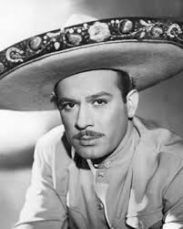
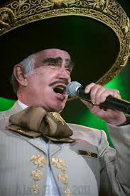
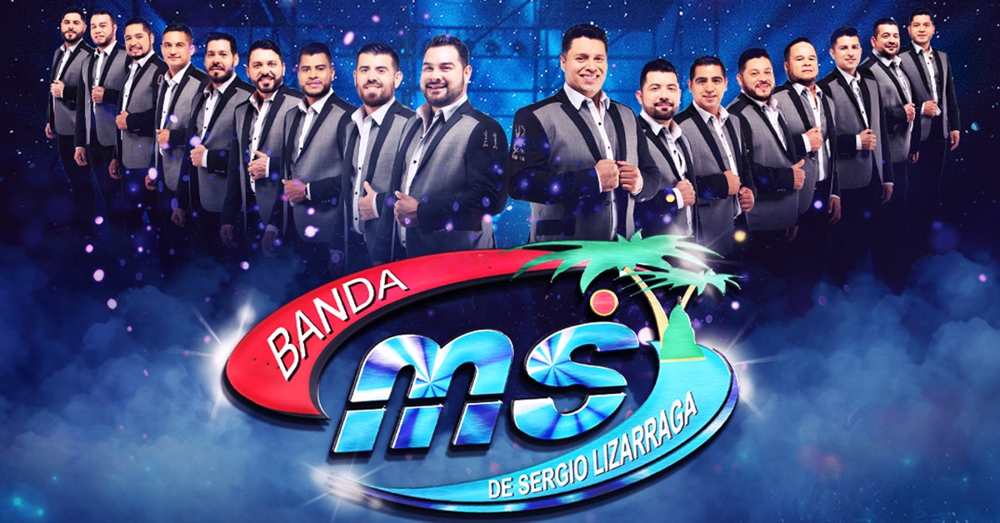
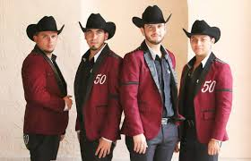
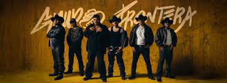

| [Music](music.md) | [Pop Culture](pop-culutre)| [Musicians](musicians.md) | [Instruments](instruments.md) | [Dance](dance.md) | [Genre](Genres.md) |
| -------- | ------- | ------- | ------ | -------- |---|

| Sub Topic: |
|-------|
| [Jazz](jazz.md) |
| [Latin Pop](latin-pop.md) |

___

## What is Regional Mexican?
### refers collectively to the regional subgenres of the country music of Mexico and its derivatives from the Southwestern United States. Each subgenre is representative of a certain region and its popularity also varies by regions. Subgenres include banda, country en Español, Duranguense, grupero, mariachi, New Mexico music, Norteño, Sierreño, Tejano, and Tierra Caliente. It is among the most popular radio formats targeting Mexican Americans in the United States.

## Time Line:
- ### 1940s - 1960s: Rise of Mariachi
    - Pedro Infante was one of many who helped popularize the genre in the 1950s during the Golden Age of Mexican Cinema.
    - Mariachi is an ensemble of musicians that typically play ranchera, the regional Mexican music dating back to at least the 18th century, evolving over time in the countryside of various regions of western Mexico.[1] The usual mariachi group today consists of as many as eight violins, two trumpets and at least one guitar, including a high-pitched vihuela and an acoustic bass guitar called a guitarrón, and all players taking turns singing lead and doing backup vocals.

        

- ### 1970s – 1980s: Popularity of Mariachi
    - This style began to increasingly spread into the United States. Many popular mariachi singers during this time include Vicente Fernández and  Juan Gabriel.

    

- ### 1990s: Rise of Several Subgenres
    - The grupero genre became one of the most popular regional Mexican genres in the United States due to its unique use of electric guitars, keyboard, and drums.

    

- ### 2000s: Duranguense and Tierra Caliente sounds
    - Mexican artists continued to release music including California-based norteño band Los Tigres de Norte, a band that has released music since the 1970s. That same decade, some new regional Mexican groups were formed, including Sinaloan banda group Banda MS.

    

- ### 2010s: Heavy Sinaloan Influence
    - Norteño-Banda, also known as norteño with tuba, had its most successful run during the early to mid 2010s with artists such as Larry Hernández, Gerardo Ortíz, Calibre 50, and Voz de Mando.

    

- ### 2020s: Global Resurgence
    - According to Spotify in 2022, Mexican music streams more than doubled since 2019 to reach 5.6 billion. The format had 150 U.S. radio stations. Some of the most listened to regional Mexican artists in the 2020s include Peso Pluma, Natanael Cano, Junior H, Grupo Frontera, Banda MS, Iván Cornejo, and Grupo Firme.

## Latin America in The United States
### Latin American music has long influenced popular music in the United States. Within the industry, "Latin music" has influenced jazz, rhythm and blues, and country music, even giving rise to unique US styles of music, including salsa, New Mexico, Tejano, and Western. Fusion genres such as Chicano rock, Nuyorican rap, and Chicano rap have emerged from Latin communities within the United States.

| Song Type | Songs |
| --------- | ----- |
| Banda | [Hábla me de ti](https://www.youtube.com/watch?v=B7-C5HergE8) By Banda MS |
| Banda | [Lo Tienes Todo](https://www.youtube.com/watch?v=a_wBQrUdcvk) By Julion Alvarez Y Su Norteño Banda |
| norteño cumbias | [Me Hizo un Favor](https://www.youtube.com/watch?v=tC6IwrAkrUs) By Grupo Frontera |
| Tejano Music | [Desvelado](https://www.google.com/url?sa=t&source=web&rct=j&opi=89978449&url=https://www.youtube.com/watch%3Fv%3DqyMp1ADlRD8&ved=2ahUKEwi0ovrmyeaIAxUblokEHWUeLs4Q78AJegQIFxAB&usg=AOvVaw37kH6io5Ak0QKWqmZAUG9X) By Bobby Pulido |
| Corrido Tumbado | [Modanna](https://www.google.com/search?client=safari&sca_esv=96be0df55f4798a8&sca_upv=1&rls=en&sxsrf=ADLYWIIbiWAIrW90-GAXyNsWEUiscj1Sfg:1727559084006&q=natanael+cano+madonna&stick=H4sIAAAAAAAAAONgFuLVT9c3NEyzLK8wSLO0VIJwyyqTTVIyjNK1BH1LizOTHYtKMotLQvKD8_PSF7GK5iWWJOYlpuYoJCfm5SvkJqbk5-UlAgBpEE3xSwAAAA&sa=X&ved=2ahUKEwj_k5-My-aIAxXxlIkEHbODFzEQri56BAhXEAM) By Natanael Cano and Óscar Maydon |
| Corrido Tumbado | [Y Lloro](https://www.youtube.com/watch?v=a8M1Es4cI_4&pp=ygUQeSBsbG9ybyBqdW5pb3IgaA%3D%3D) By Junior H |
---

## 2024 Latin GRAMMYs: Album Of The Year Nominations
### The 2024 Latin GRAMMYs, artists will compete in two new Categories this year, including Best Contemporary Mexican Music Album.

### The new Category, housed within the Regional Mexican Field, highlights six albums showcasing a rich diversity of Mexican genres. This year’s nominees are Nata Montana by Natanael Cano, DannyLux’s Evoluxion, *Jugando A Que No Pasa Nada from Grupo Frontera*, Carín León’s Boca Chueca, Vol. 1, Trastornado by Michelle Maciel, and Peso Pluma’s Génesis. The Best Contemporary Mexican Music Album Category reflects the worldwide spread and evolution of Mexican music, and its inaugural nominees embody a generation transforming traditional Mexican sounds and expanding the genre's legacy far and wide.

---

source: [Wikipedia](https://en.wikipedia.org/wiki/Regional_Mexican)
