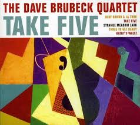
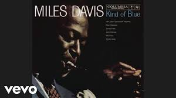
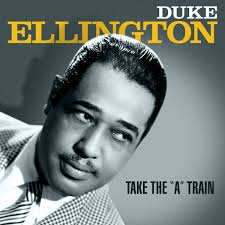
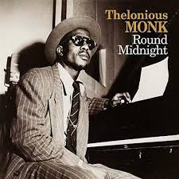
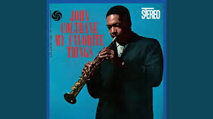
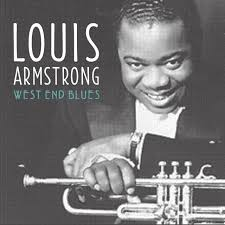

| [Music](music.md) |[Musicians](musicians.md) | [Instruments](instruments.md) | [Dance](dance.md) | [Genre](Genres.md) |
| -------- | ------- |------ | -------- |---|

| Sub Topics:|
|------------|
| [ Top Regional Mexican](popRegionalMX.md) |
| [ Top Latin Pop Songs](popLatinPop.md) |

## Popular Jazz songs:
- ### Take Five by Dave Brubeck

---

- ### So What by Miles Davis

---

- ### Take The A Train by Duke Ellington

---

- ### Round Midnight by Thelonious Monk

---

- ### My Favorite Things by John Coltrane

---

- ### West End Blues by Louis Armstrong

---
