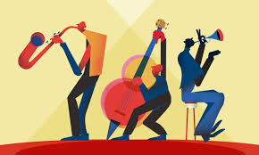
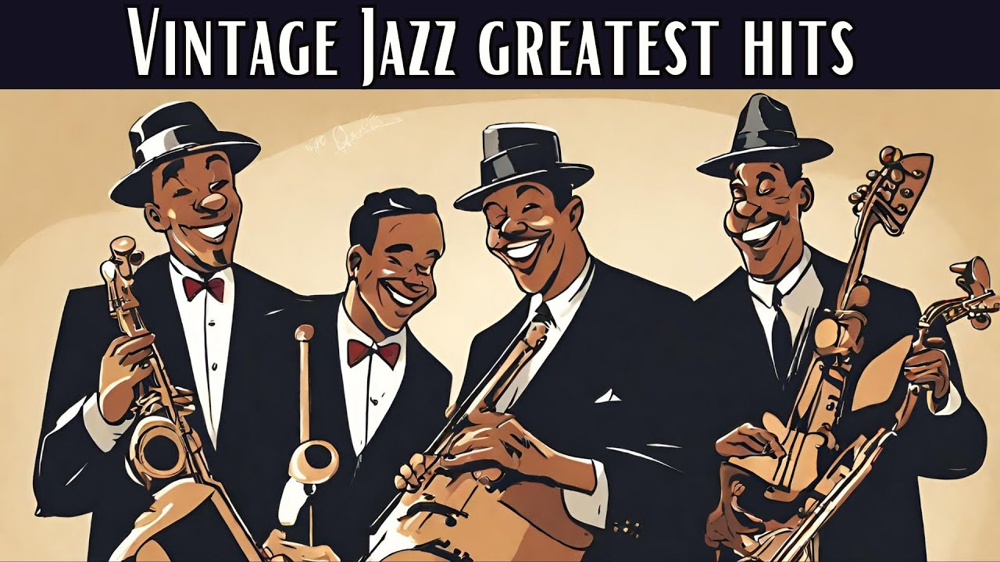

| [Regional Mexican](regional-mexican.md)| [Latin Pop](latin-pop.md) | [Genre](genres.md) |
|----- | ---- | ------- |

---

## Origin of Jazz
### Jazz is a music genre that originated in the African-American communities of New Orleans, Louisiana, in the late 19th and early 20th centuries, with its roots in blues, ragtime, European harmony and African rhythmic rituals. Since the 1920s Jazz Age, it has been recognized as a major form of musical expression in traditional and popular music. Jazz is characterized by swing and blue notes, complex chords, call and response vocals, polyrhythms and improvisation.

### As jazz spread around the world, it drew on national, regional, and local musical cultures, which gave rise to different styles. New Orleans jazz began in the early 1910s, combining earlier brass band marches, French quadrilles, biguine, ragtime and blues with collective polyphonic improvisation. However, jazz did not begin as a single musical tradition in New Orleans or elsewhere. In the 1930s, arranged dance-oriented swing big bands, Kansas City jazz (a hard-swinging, bluesy, improvisational style), and gypsy jazz (a style that emphasized musette waltzes) were the prominent styles. Bebop emerged in the 1940s, shifting jazz from danceable popular music toward a more challenging "musician's music" which was played at faster tempos and used more chord-based improvisation. Cool jazz developed near the end of the 1940s, introducing calmer, smoother sounds and long, linear melodic lines.

### Timeline:
| Date | description |
| ---- | ----------- |
| 1920's : Early Jazz / New Orleans | The tresillo rhythm is heavily used in the New Orleans Jazz of this time and can be directly linked to the music of the Caribbean. |
| 1930's : Swing and big band | By the 1930s, rules of segregation began to relax and the mixing of races in big bands became more commonplace. Along with the end of prohibition, this caused jazz to come out of the dark and onto the big stage and mainstream. |
| 1940's : Bebop | This new phase in jazz was started by the younger generation and became synonymous with "hipster" culture of the time. There was more focus on smaller ensembles that started to use the rhythm section in new ways. |
| Late 1940s-1950s : Cool Jazz |  It could be said that the intensity of the war was reflected in its music (bebop) and the development of cool Jazz was simply an evolution or thirst for a more relaxed sound. |
| Late 1950s-1960s : Hard bop/modal jazz/Latin jazz and Brazilian | The hard bop era of jazz was a partial return to the fast tempos and angular nature of bebop, fused with a heavy gospel influence and incorporation of African and Latin rhythms. |
| Late 1960s-70s : Avant garde/fusion | the use of electric instruments and rebellion of what was considered jazz began to expand quickly. |
| 1980s to present |  Jazz continues to evolve and reflect both the sociopolitical and musical trends of the time. Jazz continues to borrow elements from other styles of music ranging from classical to hip Hop and electronic music. The styles and traditions of past eras of jazz can still be heard in their traditional forms as well as borrowed from and re-contextualized and revamped. |

## Some Jazz Songs:

summertime
- Summertime (Louis Armstrong & Ella Fitzgerald)
    - Ella sings about the simpler things you can always expect to see when the sun starts shining a little brighter and the afternoons start getting warmer, like when cotton is ready for harvest and the fish swim and jump in the warm water.
- The Way You Look Tonight (Frank Sinatra)
    - is a song from the film Swing Time that was performed by Fred Astaire and composed by Jerome Kern with lyrics written by Dorothy Fields. It won the Academy Award for Best Original Song in 1936.
- At Last (Etta James)
    - is a song written by Mack Gordon and Harry Warren for the musical film Sun Valley Serenade. Glenn Miller and his orchestra recorded the tune several times, with a 1942 version

---
### Sources:
- [wikipedia](https://en.wikipedia.org/wiki/Jazz)

---
